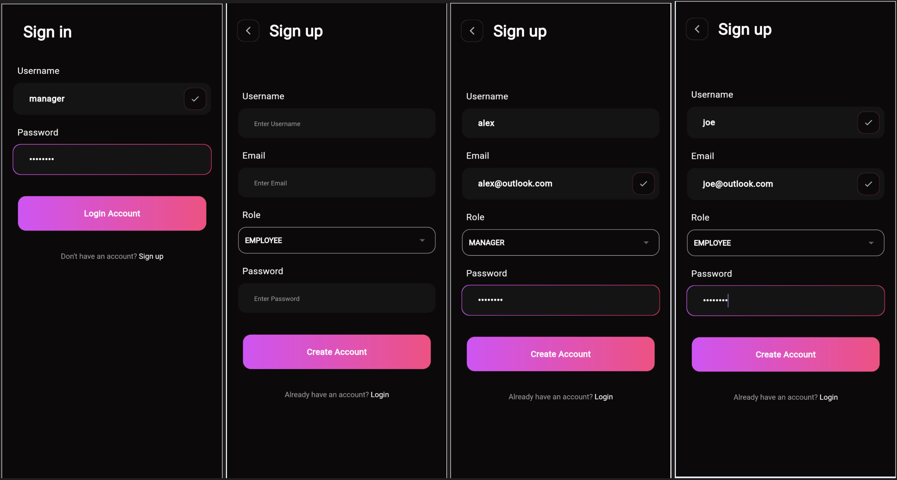
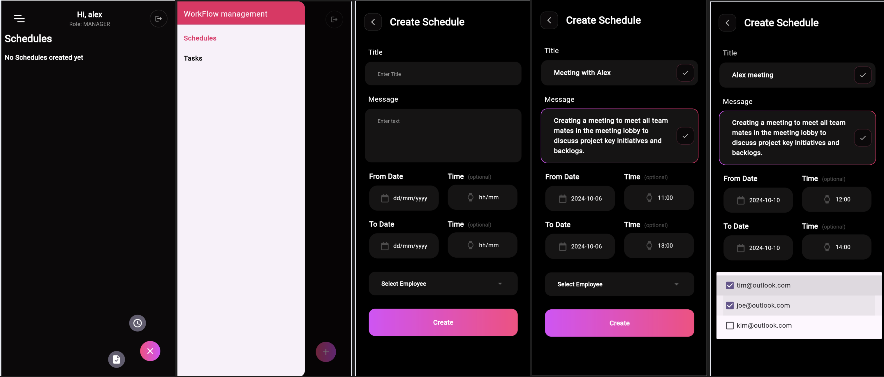
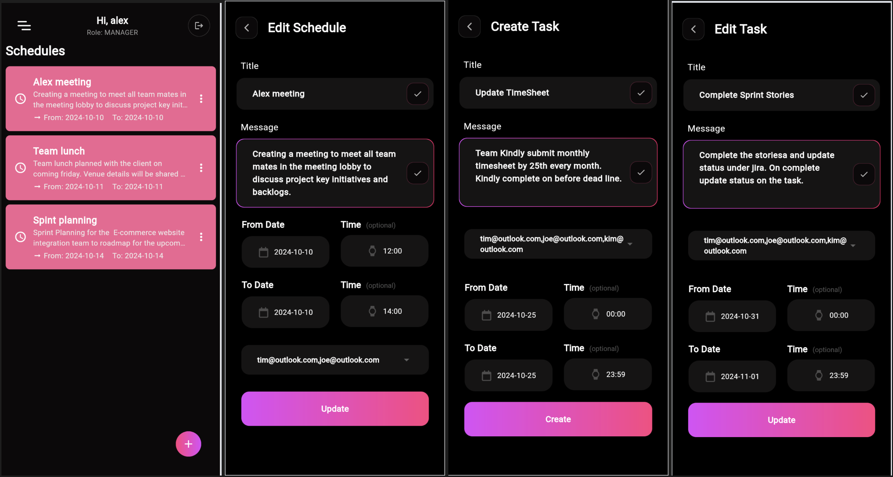
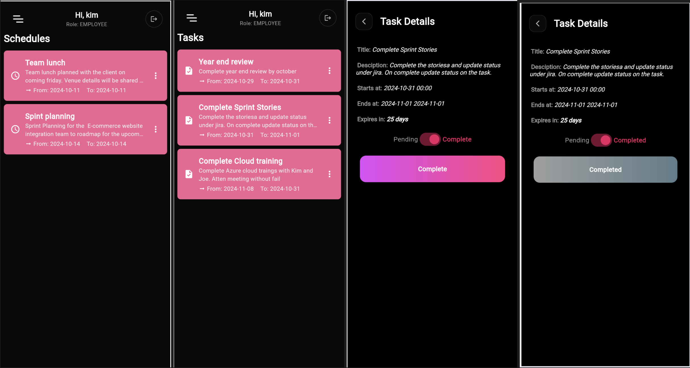

# Workforce Management System

#### *Spring Boot and Flutter application for schedule & task management .*
## Application screenshots

#### Login Screens

#### Manager Screens

#### Employee Screens

## Dependencies
- Java 8 JDK
- Embedded Tomcat 9 server
- Postgres Database
- Flutter SDK
- Maven

## Installation
### Backend
 - In Eclipse or similar IDE import the "backend" from this repo with option "import existing maven project".
 - Build the maven project to install all the required dependencies.
 - To setup database, install Postgres. Make any database.
 - Then update below three configuration fields in file **application.properties** inside **/resources** folder
>

	spring.datasource.url=jdbc:postgresql://localhost:5432/postgres
	spring.datasource.username=postgres
	spring.datasource.password=postgres

- Run the project from **Application.java**, all the tables will be initialised in database with its first run.
- Now execute **roles.sql** on your database.

### Frontend
- You should have Flutter SDK installed on your system.
- Visual Studio Code with the Flutter plugin.
- GOTO the path of **flutter_task_application** folder in comand-prompt run `flutter pub get` to get install packages.
- Run `Flutter run` and select desired environment to run.

